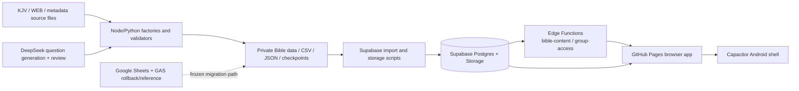

# GongBoo Bible System — Project Handover

> Last updated: 2026-08-01 (America/Los_Angeles)  
> Purpose: This is the single handover document for a new developer. It explains the product, system boundaries, data structure, key code, deployment state, and the immediate work queue.  
> Security rule: **Never put passwords, PINs, Supabase keys, DeepSeek keys, personal access tokens, or member data in this document or in Git.**

---

## 1. Product Summary

GongBoo Bible is a full-Bible learning platform intended to become the foundation product for a broader GongBoo learning system.

The core learning flow is:

`Bible passage → multiple-choice quiz → bilingual learning → speech playback → people / places / events → maps / journeys / timeline → deeper reference material`

The intended differentiation is not a small Bible trivia collection. It is a complete, connected Bible learning environment:

- KJV original and WEB modern English text
- Korean literal translation of WEB for the initial Korean text layer
- Chapter-based four-choice questions generated from the passages
- Learn / Study / Exam modes
- Text-to-speech playback, speed control, replay, auto-next
- Bible people, aliases, references, family/relationship graph
- Places, 2.5D vector map, ancient roads, journeys and timelines
- Concordance, dictionary, topics, book/chapter introductions
- Early Church and commentary/reference-library foundation
- Future paid group learning: organization, rooms, members, restricted exams and results

The broader product roadmap reuses the same architecture for K-12, AP, SAT, professional licenses, mathematics, science, music, and other subjects.

---

## 2. Canonical Locations and Source Boundaries

| Purpose | Canonical location | Notes |
|---|---|---|
| Bible private working root | `C:\Users\daeca\Desktop\gongboo.org\BIBLE` | Bible sources, generated data, local configuration and long-running scripts. |
| Public Git worktree | `C:\Users\daeca\Documents\시스템 전문가 1\biblegongboo_repo_public` | Clean publishable worktree for `biblegongboo/bible`. |
| Public repository | `https://github.com/biblegongboo/bible` | GitHub Pages application source. Treat as public. |
| Public application | `https://biblegongboo.github.io/bible/supabase/app/` | Supabase browser application. |
| Supabase project | `vwvxpzktafhiuptsrugq` | Bible production project. Never place keys in source. |
| Google Sheets/GAS version | Existing Bible spreadsheet and GAS project | Retained as historical rollback/reference; Supabase is the current primary product direction. |
| Android shell | `biblegongboo_repo_public/mobile` | Capacitor Android wrapper for the live browser application. |
| Graphics canonical source | `adopt397-dotcom/test/graphics` | Original verified development source. Bible uses a pinned local copy, not a live dependency. |

### Important operating decision

- GitHub is **public**. Do not upload raw private source datasets, credentials, paid content, database exports, or user records there.
- Supabase holds the runtime database, authentication, protected storage and server functions.
- The Google Sheets/GAS system should not be casually modified. It is a fallback/reference while Supabase is stabilized.
- Do not delete unfamiliar files, historic data, or source archives before confirming their canonical source and usage.

---

## 3. Current Delivery State

### Implemented / substantially implemented

1. Bible quiz browser application with bilingual passage/question display.
2. Learn, Study and Exam user modes.
3. Browser speech playback with replay, playback speed and auto-next.
4. OT chapter catalog and generated quiz data currently imported into Supabase.
5. People DB, aliases, 49k+ scripture references, relationships and relationship graph.
6. Places DB, ancient-modern links, maps, estimated journeys and timeline.
7. 2.5D vector map with zoom, pan, labels, roads and geography layers.
8. Bible Study reference features: verse topics, word concordance, dictionary, topics and book/chapter overview.
9. Commentary/Patristic source preparation, protected storage runtime, enable/disable source controls.
10. Supabase login/member profile system.
11. System-administrator and organization-administrator separation.
12. Organization, seats, rooms, member membership, reset-email and deletion foundations.
13. Android Capacitor shell successfully built and installed for device testing.

### Still actively being improved

- Full 66-book quiz generation and review pipeline.
- Group/organization admin UX and final exam/report workflow.
- New system-admin combined organization + manager registration flow is prepared locally but **not yet deployed**; see Section 10.
- Production quality checks for mobile responsive layout, voice availability and session recovery.
- Multilingual expansion beyond English/Korean.

---

## 4. Architecture Overview



### Client application

- Static HTML/CSS/JavaScript; hosted on GitHub Pages.
- Uses `supabase-config.js` and `supabase-auth.js` for browser-side configuration and session restoration.
- Sensitive database writes and privileged user actions go through Supabase Edge Functions, never through browser service keys.

### Server/data application

- Supabase Postgres stores structured Bible, users, organizations, quizzes and metadata.
- Supabase Storage bucket `bible-content` stores protected larger runtime content such as commentary partitions.
- `content_sources` provides a source-level kill switch: disabling a source hides all related assets without deleting its files.

### Automated question factory

- Long-running daily Bible generation uses DeepSeek plus a review pass.
- Scheduled intended window: 03:00–18:00 America/Los_Angeles.
- The current pipeline begins after generated Genesis content at `N=3036` and proceeds Exodus through Revelation, then metadata quizzes.
- Completion output must be validated for N continuity, source codes, required passage fields and catalog boundaries before import.

---

## 5. Supabase Database Structure

All application tables use Row Level Security (RLS) or protected RPC/Edge Function access. The browser must never receive a service-role key.

### 5.1 Bible core tables

| Table | Main columns | Purpose |
|---|---|---|
| `bible_sources` | `source_id`, `title`, `version_label`, `license_note`, `source_url`, `metadata`, `created_at` | Source/version registry for Bible text and imported content. |
| `bible_verses` | `source_code`, `testament`, `book_code`, `chapter`, `verse`, `kjv_text`, `web_text`, `ko_web_text`, timestamps | Canonical linked Bible verse text. `source_code` is e.g. `OT-Genesis-01-01`. |
| `bible_question_catalog` | `catalog_code`, `testament`, `book_code`, `book_name_en`, `book_name_ko`, `chapter`, `start_n`, `last_n`, generated `question_count`, `status`, `updated_at` | Chapter-level quiz ranges and catalog. |
| `bible_questions` | `n`, `source_code`, `point_code`, `q_en`, `q_ko`, `passage_en`, `passage_ko`, options `1..4` EN/KO, `answer`, explanations EN/KO, `catalog_code`, `status`, timestamps | Four-choice quiz bank. Questions are protected from public direct table access. |
| `bible_content_catalog` | `sheet_name`, `content_type`, `row_count`, `id_column`, `first_id`, `last_id`, `source_dataset`, `file_name`, `sha256`, `generated_at`, `updated_at` | Import manifest/catalog for data tables and validation. |

### 5.2 People, places, events and connections

| Table | Main columns | Purpose |
|---|---|---|
| `bible_people` | `person_id`, `canonical_name_en`, `canonical_name_ko`, `gender`, descriptions, `roles`, `tribe_id`, source IDs, `non_biblical`, `apocrypha_only`, birth/death years | Named-person base record. |
| `bible_person_aliases` | `alias_id`, `person_id`, `language`, `alias`, source identifiers | Searchable alternate names. |
| `bible_person_references` | `reference_id`, `person_id`, `source_code`, `reference_kind`, `is_key`, source identifiers | Person-to-scripture evidence references. |
| `bible_relationships` | `relation_id`, `from_id`, `to_id`, `relationship_type`, `evidence_source_codes`, `evidence_status`, `confidence`, source/status | Source-provided person relationships used by family/relationship graph. |
| `bible_places` | `place_id`, English/Korean names, aliases, feature types, `latitude`, `longitude`, precision, descriptions, source/status | Biblical location records. |
| `bible_events` | `event_id`, EN/KO titles, candidate chronology fields, predecessor/part-of IDs, source codes, participant/place source IDs | Event/timeline base records. |
| `bible_journeys` | `journey_id`, `title`, `person_id`, `sequence_no`, `geometry`, `properties`, source | Journey routes, including source-provided and estimated routes. |
| `bible_related_entities` | `entity_id`, `entity_type`, EN/KO names, source/status | Miscellaneous structured related entities. |

### 5.3 Authentication and member profile tables

| Table | Main columns | Purpose |
|---|---|---|
| `auth.users` | Supabase-managed identity | Managed by Supabase Auth. Never query or write from browser directly. |
| `member_profiles` | `id`, `email`, `display_name`, `phone`, `account_type`, `payment_status`, `expired_date`, `access_subjects`, `is_trial`, `trial_start`, `trial_limit`, `set_size`, `active`, legacy import metadata, timestamps | Application membership/profile layer. An Auth trigger creates it for new users. |

Important profile behavior:

- `account_type='admin'` means **system administrator**.
- Ordinary users and organization administrators are `account_type='personal'`; organization-admin rights come from assignment table, not global admin type.
- PIN/passwords are never saved in this table as plaintext.

### 5.4 Organization / paid learning tables

| Table | Main columns | Purpose |
|---|---|---|
| `learning_organizations` | `id`, `organization_name`, `seat_limit`, `memo`, `active`, `created_by`, timestamps, `room_limit`, `subscription_status`, `subscription_ends_at` | A church, seminary, school or group contract. `active=false` is logical deletion. |
| `learning_organization_admins` | `organization_id`, `user_id`, `active`, `created_at` | Connects an organization administrator to one or more organizations. |
| `learning_organization_members` | `id`, `organization_id`, `member_name`, `login_email`, `registration_number`, `memo`, `auth_user_id`, `password_reset_required`, `active`, timestamps | Organization learner; one active member consumes one organization seat. |
| `learning_rooms` | `id`, `organization_id`, `room_name`, `memo`, `active`, `archived_at`, `created_by`, timestamps | A subgroup such as youth group, class or department. Archive is non-destructive. |
| `learning_room_members` | `room_id`, `member_id`, `joined_at` | Room membership; joining multiple rooms does not use extra seats. |
| `learning_exams` | `id`, `organization_id`, `room_id`, title/instructions, `subject_code`, question range, time/date fields, `status`, `created_by`, timestamps | Room-restricted exam definition. |
| `learning_exam_attempts` | `id`, `exam_id`, `member_id`, start/submit fields, correct/question counts, score, status | One learner attempt per exam. |
| `learning_exam_answers` | `attempt_id`, `question_number`, `selected_answer`, `is_correct`, `answered_at` | Individual answer records. |

### 5.5 Content source and protected Storage tables

| Table | Main columns | Purpose |
|---|---|---|
| `content_sources` | `source_id`, `content_type`, title/author/URL/license label, `status`, `enabled`, `image_enabled`, `commentary_enabled`, `display_order`, `metadata` | Source registry and fast global enable/disable switch. |
| `bible_content_assets` | `asset_id`, `source_id`, `asset_type`, `storage_bucket`, `storage_path`, `content_type`, `byte_size`, `sha256`, `enabled`, `metadata` | Index to protected stored files. |
| `storage.objects` / bucket `bible-content` | Managed Supabase Storage records | Non-public object bucket. Read access is allowed only if its source and asset are enabled. |

### 5.6 Key RPC functions

| Function | Access / purpose |
|---|---|
| `get_my_bible_membership()` | Logged-in user profile and access state. |
| `update_my_bible_profile(name, phone)` | Self profile update. |
| `require_bible_admin_()` | Internal guard for system administrator only. |
| `list_learning_organizations()` | System admin active organization list, seat/member count. |
| `create_learning_organization(name, seats, memo)` | System admin organization creation (legacy separate flow). |
| `list_learning_organization_members(org_id)` | System or assigned organization administrator member list. |
| `list_my_learning_organizations()` | System or assigned organization administrator visible organizations. |
| `create_learning_room()`, `archive_learning_room()`, `assign_learning_room_member()` | Organization-scoped room administration. |
| `list_learning_organization_admins(org_id)` | **Prepared in migration `20260801090000`; not yet production deployed as of this handover.** |

---

## 6. Supabase Functions and Web Application Files

### Edge Functions

| File | Function |
|---|---|
| `supabase/functions/bible-content/index.ts` | Authorized quiz/question/content endpoints; keeps question-bank access out of public direct table queries. |
| `supabase/functions/group-access/index.ts` | Organization actions: list organizations, member email/PIN login, create member, create org manager, delete organization/member, password reset. Includes prepared `create_organization_with_admin` action that must be deployed with migration `20260801090000`. |

### Web application files

| File | Function |
|---|---|
| `supabase/app/index.html` | Main Bible learning screen shell. |
| `supabase/app/main.js` | Main quiz engine, modes, rendering, audio controls, API calls and local progress behavior. Large file; avoid broad unrelated rewrites. |
| `supabase/app/login.html` | Standard Bible authentication entry. |
| `supabase/app/supabase-auth.js` | Browser session restoration, sign-in/out, profile retrieval. |
| `supabase/app/supabase-config.js` | Public browser configuration only: Supabase URL and publishable key. No secret key. |
| `supabase/app/supabase-provider.js` | Supabase data provider integration. |
| `supabase/app/bible-explorer.js` | People / places / events / atlas / timeline / reference explorer interactions. |
| `supabase/app/group-admin.html` | System-admin organization provisioning screen. Locally rebuilt for combined organization + first manager registration; deployment pending token fix. |
| `supabase/app/organization-manager.html` | Organization administrator workspace for members and rooms. |
| `supabase/app/group-login.html` | Organization member email + PIN login screen. |
| `supabase/app/reset-password.html` | Supabase recovery-link page for secure password change. |
| `supabase/app/guide.html`, `USER-GUIDE.ko.md` | Initial end-user guide. The markdown is source; do not expose private architecture through public guide links. |

### Important user experience conventions

- Personal/free learning should remain as simple as possible.
- Organization users log in by email ID plus a numeric PIN of 4–12 digits during initial account flow.
- Password reset is emailed using a one-time Supabase recovery link. Do not send plaintext temporary passwords.
- A system admin is responsible for organization identity and purchased seats.
- An organization admin is limited to assigned organization(s), its members, rooms and later exams/reports.

---

## 7. Content Factory, Import and Validation Scripts

| File / group | Function |
|---|---|
| `scripts/daily_bible_pipeline.mjs` in private Bible root | Daily long-running quiz generation orchestration. |
| `scripts/generate_metadata_quizzes_deepseek.mjs` | Generates metadata-oriented quizzes. |
| `scripts/sync_bible_workbook_to_supabase.py` | Imports workbook data to Supabase. |
| `scripts/sync_member_workbook_to_supabase.mjs` | Imports/synchronizes member workbook data. |
| `scripts/import_supabase_content.mjs` | General content import. |
| `scripts/migrate_runtime_content_to_supabase.mjs` | Migrates prepared runtime JSON/content to Supabase. |
| `scripts/migrate_commentary_to_supabase.mjs` | Phase-one commentary migration. |
| `scripts/migrate_remaining_commentary_to_supabase.mjs` | Remaining commentary batch migration. |
| `scripts/prepare_remaining_commentary_runtime.mjs` | Deduplicates and prepares remaining source partitions. |
| `scripts/validate_remaining_commentary_runtime.mjs` | Validates commentary runtime partitions before upload. |
| `scripts/backup_supabase_bible.mjs` | Database/content backup support. |
| `scripts/build_bible_context_update.mjs` | Builds map / geography context update. |
| `scripts/build_bible_entity_context.mjs` | Builds people-place-event-context links. |
| `scripts/build_bible_geography_layers.mjs` | Builds geographic features such as rivers/regions. |
| `scripts/build_bible_map_factory.mjs` | Builds 2.5D map input assets. |
| `scripts/build_estimated_journeys.mjs` | Generates disclosed estimated journeys from structured locations. |
| `scripts/build_bible_knowledge_pipeline.mjs` | Consolidates map, people, events, journeys, timeline, Patristic and knowledge outputs. |
| `scripts/build_bible_knowledge_extensions.mjs` | Builds semantic entities, concordance, dictionary, topic and modern-place extensions. |
| `scripts/build_patristic_deep_content.mjs` / `build_patristic_reader_content.mjs` | Prepares Early Church/Patristic index and reader material. |
| `scripts/audit_commentary_sources.mjs` | Source audit and licensing metadata review. |
| `scripts/configure_supabase_browser_app.mjs` | Generates browser config from local secret config without committing secrets. |

### Validation policy

Before importing generated quizzes, verify at least:

1. `N` is sequential with no duplicate/missing values.
2. `SOURCE_CODE` follows the canonical OT/NT code format.
3. Four choices exist and `A` is 1–4.
4. Required bilingual question/explanation fields are not silently blank.
5. `P_EN`/`P_KO` passage fields are filled where the current runtime requires them.
6. Catalog `start_n` and `last_n` exactly match the actual question rows.
7. Original source text is preserved; AI must not overwrite canonical source verse text.

---

## 8. Bible Data and Content Status

### Text and quiz content

- KJV and WEB text were imported into Google Sheets and the Supabase Bible text tables.
- Korean literal WEB translation is maintained as a separate text layer rather than an interpretation-heavy denomination-specific translation.
- Genesis has established the test pattern and has thousands of generated questions; later books are being generated from `N=3036` onward.
- The goal is a chapter-based question bank where every verse has at least one useful learning question and additional questions only when non-duplicative learning value exists.

### People / relationship data

- Approximately 3,245–3,246 person records.
- Approximately 49,582 person-to-scripture reference records.
- Thousands of source-provided relationships; relationship graph should show a clean individual card if no relationship data exists rather than an error-looking panel.

### Geography / map data

- About 1,300+ located Bible places, ancient roads, river/region GeoJSON layers and modern-place candidates.
- The map is a 2.5D vector style, not raster-only: supports smooth pan/zoom and labels without pixelation.
- Estimated journeys must be labelled as estimated/inferred where source data is not a directly supplied route.

### Knowledge/reference data

- Semantic entities, concordance entries, dictionary entries, topics, books and chapters are produced in lazy-loadable partitions.
- External image records currently prefer links/metadata rather than copying every image binary; future use must respect each source/license policy.
- Commentary runtime is large and should remain partitioned by book/source for on-demand loading.

---

## 9. JSON-Based Mathematics / Geometry / Graphics Renderer

This capability is a reusable `COMMON` GongBoo engine. It is important for future mathematics, science and educational content, and can also render Bible relation maps, timelines and geographic overlays.

### Canonical ownership and copy policy

- Canonical graphics development source: `github:adopt397-dotcom/test/graphics`.
- Bible should use a **verified local pinned copy** under its own `graphics/` directory.
- Do not make Bible runtime depend directly on the TEST repository URL.
- Do not copy unrelated `main.js`, login, authentication or quiz files from TEST. Copy only graphics assets and the required graphics router integration.

### Renderer design

1. Content is described as JSON, with a `schemaVersion` and a renderer/type identifier.
2. A renderer router selects the required drawing component only when a question/content item uses it.
3. This avoids loading all 2D/3D/geometry engines on ordinary text questions.
4. Existing system supports chart-like graphics, geometry 2D, JSON/LaTex preview and extensible renderers.
5. The 2.5D map is a separate but compatible vector rendering approach: coordinates, labels, linework, regions, route geometry and interactive transform state are data-driven.

### Recommended JSON conventions for future academic graphics

```json
{
  "schemaVersion": "1.1",
  "type": "geometry-2d",
  "title": "Triangle similarity example",
  "viewport": {"width": 800, "height": 500},
  "objects": [
    {"kind": "point", "id": "A", "x": 120, "y": 340, "label": "A"},
    {"kind": "segment", "from": "A", "to": "B", "style": {"stroke": "#2563eb"}}
  ],
  "annotations": [],
  "accessibility": {"description": "A labeled triangle used for a similarity question."}
}
```

### Rules for future renderer work

- Use semantic object IDs, not positional magic numbers alone.
- Keep raw content JSON separate from JavaScript renderer code.
- Keep source/author/license metadata with imported templates/images.
- Add `accessibility.description` for screen readers and speech support.
- For maps/routes, store source confidence and whether geometry is historical, source-provided or estimated.
- Test mobile viewport, zoom/pan and label collision behavior before publishing.

---

## 10. Current Undeployed Change: Organization Re-registration and Combined Provisioning

The following work is written locally in the public worktree but was not deployed because the currently configured Supabase management token can read the project but returns HTTP 401 for `database/query` (missing `database_write` privilege).

### Files

- `supabase/migrations/20260801090000_reuse_deleted_organizations_and_list_admins.sql`
- `supabase/functions/group-access/index.ts`
- `supabase/app/group-admin.html`

### Intended behavior

1. When a system admin logically deletes an organization (`active=false`), its name becomes reusable for a later registration.
2. Historic deleted record stays in database for recovery/history.
3. System admin registration form accepts in one operation:
   - organization name
   - purchased seats
   - memo
   - first organization manager name
   - manager email ID
   - initial numeric PIN (4–12 digits)
4. The Edge Function creates both organization and first manager. If manager creation fails, it removes the newly created organization to avoid a half-configured record.
5. Selecting an organization shows manager name and email.
6. PIN is never displayed after creation. Recovery uses reset email.

### Deployment prerequisite

Create/store a Supabase **owner** personal access token with database write and Edge Function deployment permissions in the local private configuration only. Do not paste it into chat or Git.

Then:

1. Apply migration `20260801090000_reuse_deleted_organizations_and_list_admins.sql`.
2. Deploy Edge Function `group-access`.
3. Parse/check browser scripts and Edge source.
4. Commit and push the three files.
5. Test: create sample org → delete it → recreate same name → verify manager name/email shown → verify reset email control.

---

## 11. Deployment, Secret Handling and Backup

### Secrets

- Local secret configuration is intentionally outside public Git, under the private Bible root.
- Expected variable names include `SUPABASE_URL`, `SUPABASE_PUBLISHABLE_KEY`, `SUPABASE_SECRET_KEY`, and `SUPABASE_ACCESS_TOKEN`; actual values must never be committed.
- `SUPABASE_PUBLISHABLE_KEY` may be used in browser config only with correct RLS policies.
- `SUPABASE_SECRET_KEY`/service-role credentials are server-only.
- DeepSeek keys are server/script-only.

### Supabase backup

- Run/maintain `backup_supabase_bible.mjs` before material schema/data changes and on a regular schedule.
- Export key structured tables plus Storage manifest. Keep exports in a private, dated backup location.
- For organization data, verify backup includes organizations, administrators, members, rooms, exams, attempts and answers.
- Before production sales, establish a documented restore test, not only backups.

### GitHub cleanup

- Public repo can expose current and historic Git commits. Removing a file in a new commit does not remove it from prior commit history.
- If sensitive material was ever committed: make a verified private backup, rewrite history only with deliberate approval, force-push, rotate exposed keys, and validate Pages deployment afterward.
- Prefer moving runtime data to Supabase/private storage and keeping GitHub limited to application source and non-sensitive deployment assets.

---

## 12. Known Constraints and Safety Decisions

1. **Source text integrity:** KJV/WEB original text must be stored and rendered verbatim from canonical imported sources. AI can generate questions/translations but must not silently edit source text.
2. **Theology/interpretation:** Present source facts and clearly distinguish data/source description from inferred/estimated material. Avoid denomination-specific assertions in core quiz text.
3. **Routes and chronology:** Some geography/journey/timeline material is estimated or source-dependent. Label it appropriately; do not present every route as certain historical fact.
4. **Licensing:** Keep source metadata and a source-level enable/disable control. Home-page acknowledgement can summarize sources, but do not remove internal source tracking.
5. **RLS/security:** Never weaken RLS merely to make a browser feature work. Use Edge Functions or protected RPCs for privileged operations.
6. **Organizations:** Logical delete/archive is preferred for organizations and rooms. Do not destructively delete real organization learning history without explicit operational approval.
7. **Google Sheets/GAS:** Treat existing working Google implementation cautiously; make reversible changes only and retain backups.
8. **Mobile:** Android is a wrapper around the live web app. Any web UI change must be tested in a narrow mobile viewport and a physical Android device.

---

## 13. Next Steps for the Next Developer

### Priority 1 — Deploy the prepared organization fix

- Obtain a Supabase owner management token with correct write scopes.
- Deploy migration `20260801090000_reuse_deleted_organizations_and_list_admins.sql`.
- Deploy `group-access` Edge Function.
- Publish updated `group-admin.html` only after API/schema deployment succeeds.
- Verify same-name re-registration after logical deletion.

### Priority 2 — Complete group-learning paid mode

- Verify system admin can provision organization + seats + first manager.
- Verify organization manager can create/archive rooms and register/delete members.
- Implement organization manager password/PIN reset test with real SMTP inbox.
- Implement room-only exam creation, publication, attempt capture, grading and history.
- Implement result dashboard/export for organization admin.
- Add quota display: purchased seats, active seats, room limit and subscription status.

### Priority 3 — Stabilize core learning product

- Finish OT/NT question generation through all 66 books.
- Import validated completed books into Supabase in controlled batches.
- Improve handling of short network failures: clear loading state, retry safely, do not erase session.
- Test Learn/Study/Exam, passage/quiz toggles, speech playback, language combinations, keyboard controls and resume state.
- Keep question and catalog numbering sequential across imports.

### Priority 4 — Content and reference quality

- Complete place/person/event bidirectional links.
- Keep journey confidence/estimated labels visible.
- Refine 2.5D map label collision, responsive controls and mobile performance.
- Add only properly indexed/controlled commentary and Early Church content; keep large source partitions lazy-loaded.
- Decide final image strategy: external source links first; copy binaries to protected Storage only where justified.

### Priority 5 — Mobile and launch readiness

- Improve mobile header/button density and visible pressed-state feedback.
- Make speech controls fail gracefully if device text-to-speech is unavailable.
- Add logout icon and verify session switching.
- Build signed Android APK/AAB after browser functionality stabilizes.
- Prepare tester distribution and Play Console closed-test requirements.

### Priority 6 — General GongBoo platform reuse

- Extract common capabilities only after Bible implementation is stable: identity, subject catalog, quiz runtime, progress, organization learning, JSON graphics router and AI feedback.
- Use JSON renderer templates for math/science questions; do not duplicate separate rendering engines per subject.
- Bring K-12, AP/SAT, licenses and music into the same secure Supabase architecture incrementally.

---

## 14. Minimum Smoke-Test Checklist

Before calling a deployment stable, test:

1. Standard login and logout.
2. Lesson selection and quiz loading.
3. Learn / Study / Exam behavior.
4. Passage display with chosen language layers.
5. Text-to-speech: Play, replay, stop, speed and auto-next.
6. People search by first character/name/alias; individual detail and relationship graph.
7. Place search; map zoom, pan, fit-all, map/person/event links.
8. Timeline event click and returned event detail.
9. Dictionary/words/topics search immediately filters by typed prefix.
10. Organization system admin and organization manager permission boundaries.
11. Member email/PIN login and recovery email.
12. Narrow mobile browser and Android Capacitor shell.

---

## 15. First Command/Inspection Sequence for a New Developer

1. Read this file.
2. Read `PORTFOLIO/README.md`, `PORTFOLIO/REGISTRY.json`, `PORTFOLIO/DECISIONS.md`, and the current Bible thread handoff in `PORTFOLIO/THREADS/`.
3. Confirm the clean public worktree and inspect `git status` before editing.
4. Confirm the local private configuration file exists without displaying credentials.
5. Read pending migrations before applying anything.
6. Run syntax checks and `git diff --check`.
7. Deploy additive schema first, Edge Function second, static browser page third.
8. Execute the smoke test checklist using sample data only.
9. Update `PORTFOLIO/THREADS/BIBLE-people-db.md` with exact deployment, validation and next action.

---

## 16. Project Principle

The product should favor broad automated coverage first:

> **Build the complete useful system first; identify and manually correct only the important exceptions later.**

Do not allow perfectionism in isolated data cases to stop the whole-Bible learning platform from shipping and improving.
